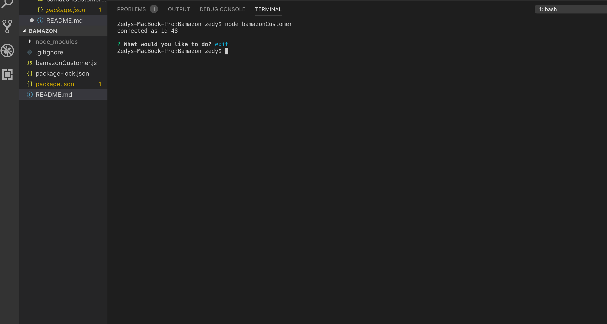
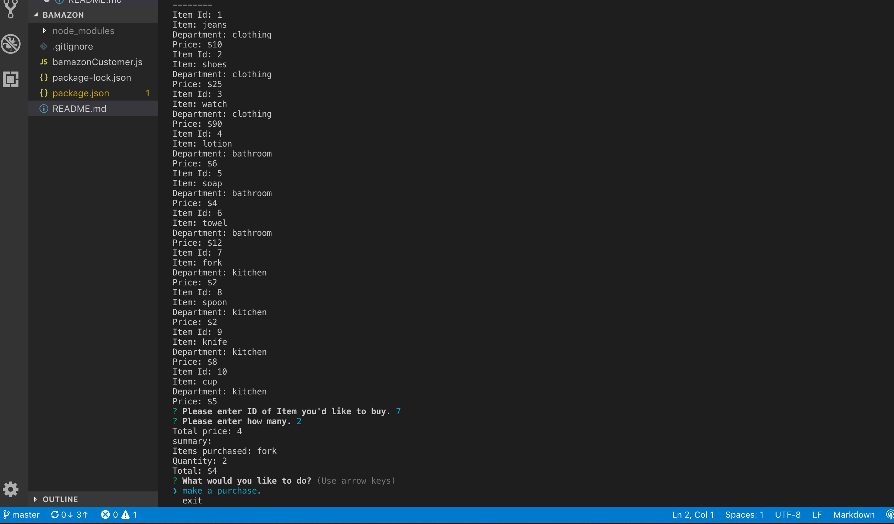
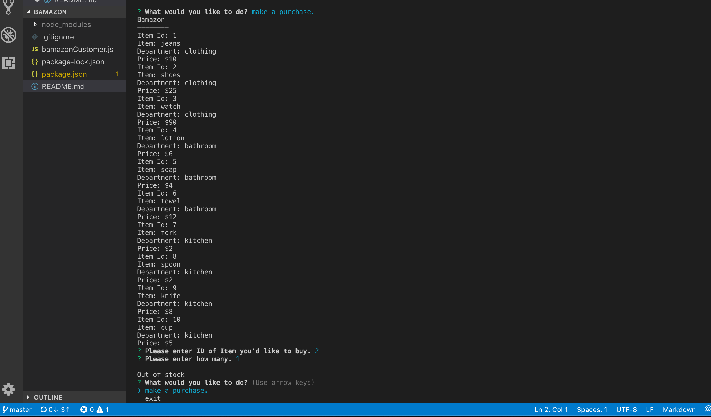

# Bamazon
Bamazon

* User Instructions:
* First the app will ask you for the ID of the item you'd like to purchase.
* Second, the app will ask you what quantity.
   * If not enough of the item is in inventory, the app will log `Out of Stock!`. You will not be able to complete your order.
   * If there is enough of the item in inventory the app will allow you to complete your order. It will log a summary of you order and the total you will have to pay.
   
* User Screenshoots
  * Exit App
     
  * Purchase Item - instock
     
  * Purchase Item - out of stock
     
   
 
        
